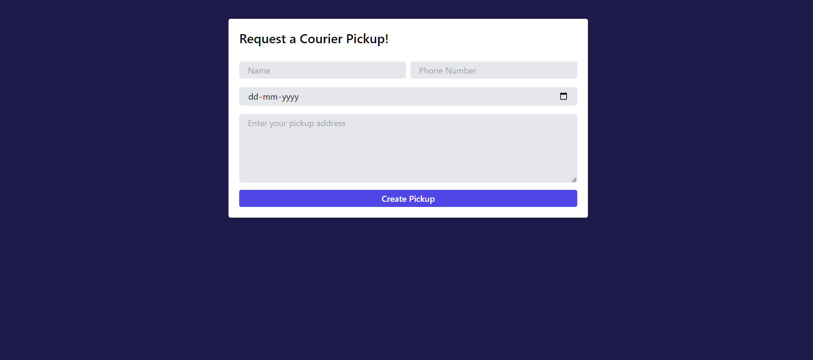
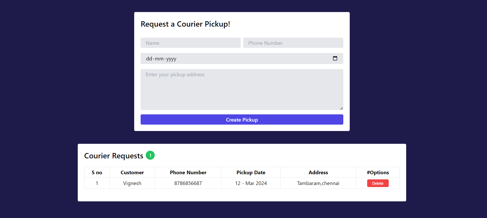

# Courier Pickup

Courier Pickup is a web application where users can request courier pickups and manage their requests. It is built using HTML, JavaScript, JS DOM, and Tailwind CSS, and developed with Vite.


## Table of Contents
- [Screenshots](#screenshots)
- [Live-link](#livelink)
- [Installation](#installation)
- [Usage](#usage)
- [Features](#features)
- [License](#license)

## Screenshots
- **ScreenShot 1**
  
- **ScreenShot 2**  
  


## Live-Link
[https://san1234100.github.io/courier-pickup-form/](https://san1234100.github.io/courier-pickup-form/)

## Installation

1. Clone the repository:

```bash
git clone https://github.com/san1234100/courier-pickup-form.git
```
2. Navigate into the project directory:
```bash
cd courier-pickup-form
```

3. Install dependencies using npm or yarn:
```bash
npm install
```

4. Start the development server:
```bash
npm run dev
```


## Usage
Once the application is running, users can:

- Submit courier pickup requests.
- Delete previously submitted requests.

## Features
- Submit courier pickup requests with details such as pickup location, delivery address, package details, etc.
- View a list of submitted requests.
- Delete requests from the list.

## License
[MIT](./License)


# Happy coding!😁🧑‍💻
